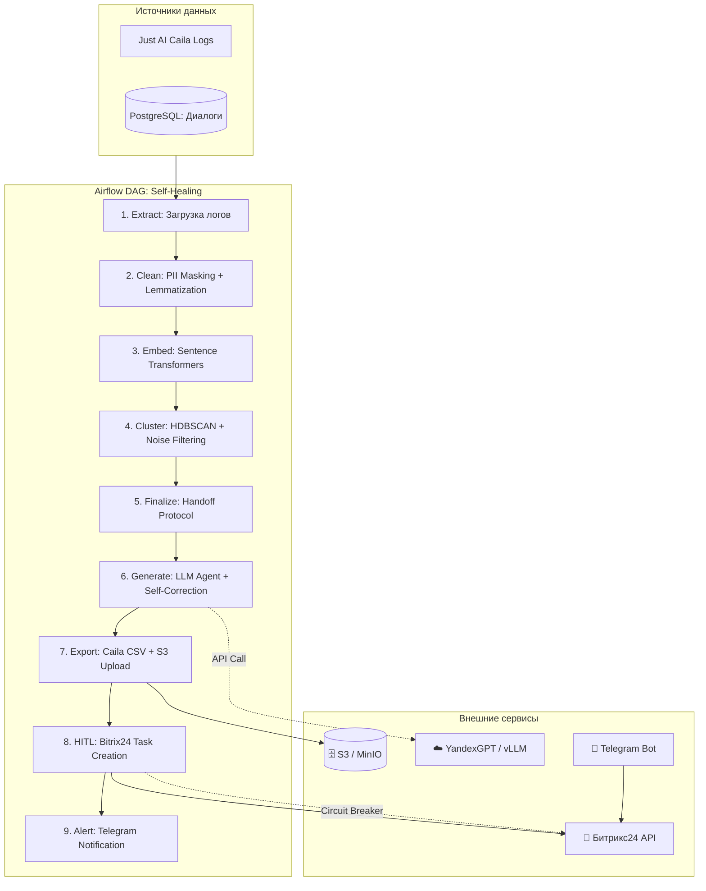
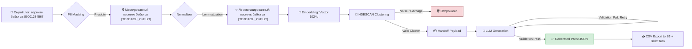
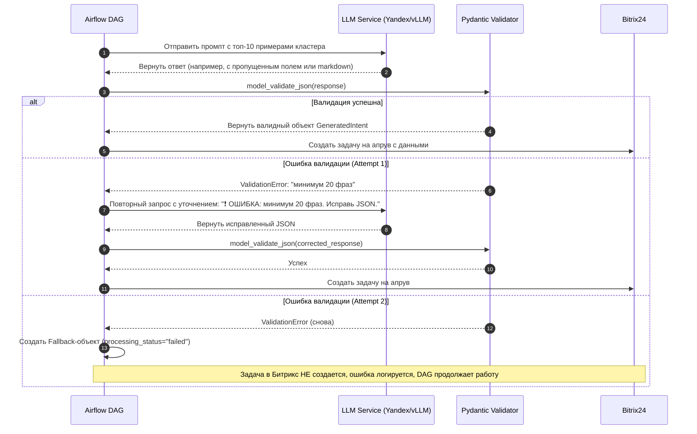

# 🔄 Self-Healing NLU MLOps Pipeline

[](https://www.python.org/)
[](https://airflow.apache.org/)
[](https://docs.pydantic.dev/latest/)
[](https://hdbscan.readthedocs.io/)
[](https://yandex.cloud/services/foundation-models)

**Автономная MLOps-платформа для непрерывного самообучения диалоговых ботов.** 
Система автоматически обнаруживает «слепые зоны» (fallback-запросы) в диалогах, кластеризует новые намерения клиентов и генерирует готовые обучающие датасеты с соблюдением 152-ФЗ и обязательным контролем человека (Human-in-the-Loop).

---

## 📖 О проекте

**Описание конечной системы:**
Система представляет собой асинхронный, событийно-ориентированный (Event-Driven) MLOps-пайплайн, работающий в фоновом режиме. Он автоматически анализирует логи диалогов, в которых NLU-бот (Just AI Caila или кастомный) не смог распознать намерение (fallback) или передал диалог на оператора. 

**Особенности реализации:**
Система решает проблему деградации качества NLU-ботов со временем. Вместо ручного перебора тысяч строк логов, платформа использует событийно-ориентированный пайплайн (Apache Airflow) для:
1. **Безопасного извлечения** логов с тегами `fallback` или `transfer_to_operator`.
2. **Жесткой анонимизации PII** (Presidio) *до* любых ML-операций.
3. **Векторизации и кластеризации** (Sentence Transformers + HDBSCAN) с многоуровневой фильтрацией шума.
4. **Генерации интентов** через LLM (YandexGPT / vLLM) с механизмом автоматической самокоррекции (Self-Correction) при ошибках валидации.
5. **Доставки результата** аналитику через Битрикс24 и Telegram для финального апрува (HITL) и последующего импорта в Just AI Caila.

Система не просто агрегирует ошибки, а **самостоятельно находит новые паттерны**: очищает "шумные" данные от ошибок ASR и мусора, группирует схожие высказывания в смысловые кластеры, с помощью LLM присваивает им имена и генерирует готовые обучающие выборки. Финальный результат проходит обязательную валидацию человеком (Human-in-the-Loop) через интерфейс Битрикс24 перед импортом в боевую среду.

**Бизнес-задача:**
1. **Сокращение трудозатрат лингвистов на 70%:** Исключение ручного перебора тысяч строк логов. Аналитик получает не "сырые" логи, а готовые гипотезы новых интентов с вариациями фраз.
2. **Ускорение реакции на изменения рынка:** Мгновенное выявление массовых запросов о новых акциях, сбоях или изменениях в продуктах, которые еще не заложены в сценарии бота.
3. **Повышение качества NLU:** Систематическое закрытие "слепых зон" бота, что напрямую снижает процент fallback-ответов и переводов на оператора.
4. **Гарантия безопасности данных:** Полная автоматизация процесса с жестким контролем PII, исключающим риск попадания персональных данных клиентов в промпты LLM.

---

## 🏗️ Архитектура системы

### 1. Высокоуровневая архитектура компонентов
Система построена по принципам MLOps с четким разделением ответственности, идемпотентностью и защитой от каскадных сбоев (Circuit Breaker).



### 2. Поток данных и трансформация (Data Flow)
Детализация того, как "грязный" лог превращается в структурированный интент.



### 3. Sequence Diagram: Жизненный цикл обработки кластера (LLM Stage)
Иллюстрация механизма Self-Correction, предотвращающего падение DAG из-за галлюцинаций формата LLM.



---

## 📚 Карта документации

Проект обладает исчерпывающей, поэтапной документацией. Используйте ссылки ниже для перехода к нужному уровню детализации.

### 📋 Общее описание и стратегия
| Документ | Описание |
| :--- | :--- |
| 📄 **[specification.md](specification.md)** | Полное Техническое Задание: бизнес-цели, KPI, функциональные/нефункциональные требования, стек. |
| 🗺️ **[phases.md](phases.md)** | Высокоуровневая дорожная карта (Roadmap) реализации проекта. |
| 🔍 **[review.md](review.md)** | **Architecture Review:** Аудит кода, список улучшений для Enterprise-уровня (DI, MLflow, K8s Hardening, LLM-as-a-Judge). |

### 🏗️ Этап 1: Фундамент, ETL и Безопасная очистка данных
| Документ | Описание |
| :--- | :--- |
| 📦 **[phase_1_step_1.md](phase_1_step_1.md)** | Инициализация Airflow, строгая конфигурация (Pydantic), идемпотентная выгрузка логов из Caila/PostgreSQL. |
| 🔒 **[phase_1_step_2.md](phase_1_step_2.md)** | Реализация модуля строгого маскирования PII на базе `Microsoft Presidio` с кастомными паттернами для РФ. |
| 🧹 **[phase_1_step_3.md](phase_1_step_3.md)** | Эвристическая очистка "мусора" (ASR-артефакты) и глубокая лемматизация через `pymorphy3`. |

### 🧠 Этап 2: Векторизация и Кластеризация
| Документ | Описание |
| :--- | :--- |
| 🧮 **[phase_2_step_1.md](phase_2_step_1.md)** | Асинхронная векторизация с батчингом (`Sentence Transformers`), оптимизация памяти, сохранение в Parquet. |
| 🧲 **[phase_2_step_2.md](phase_2_step_2.md)** | Настройка `HDBSCAN`, критическая калибровка гиперпараметров и отсечение шума. |
| 📦 **[phase_2_step_3.md](phase_2_step_3.md)** | Финальная валидация кластеров (Silhouette score, фильтрация дубликатов) и Handoff Protocol для LLM. |

### 🤖 Этап 3: LLM-агент и Генерация данных
| Документ | Описание |
| :--- | :--- |
| 📝 **[phase_3_step_1.md](phase_3_step_1.md)** | Проектирование промпта и строгих Pydantic V2 схем для гарантированного JSON-вывода. |
| 🔄 **[phase_3_step_2.md](phase_3_step_2.md)** | Реализация механизма валидации и Self-Correction (автоматический retry с уточнением ошибки). |
| 🔌 **[phase_3_step_3.md](phase_3_step_3.md)** | Интеграция с LLM-провайдером (абстракция для YandexGPT / vLLM) и управление секретами. |

### 🏢 Этап 4: HITL, Интеграции и Экспорт
| Документ | Описание |
| :--- | :--- |
| 📥 **[phase_4_step_1.md](phase_4_step_1.md)** | Генератор CSV-файлов для импорта в Just AI Caila и загрузка в S3 с Presigned URL. |
| 🛡️ **[phase_4_step_2.md](phase_4_step_2.md)** | Интеграция с Битрикс24 REST API с богатой HTML-разметкой и защитой через **Circuit Breaker** (`pybreaker`). |
| 📱 **[phase_4_step_3.md](phase_4_step_3.md)** | Настройка Telegram-бота для мгновенного алертинга аналитика (fail-soft логика). |

### 🚀 Этап 5: Production Hardening и IaC
| Документ | Описание |
| :--- | :--- |
| 🏗️ **[phase_5_steps.md](phase_5_steps.md)** | Multi-stage Docker build, Terraform концепт, OpenTelemetry трассировка, Prometheus-алерты и Locust нагрузочное тестирование. |

---

## 🛠️ Технологический стек

*   **Оркестрация:** Apache Airflow 2.8+ (LocalExecutor / Celery), Python 3.12.
*   **ML & NLP:** `sentence-transformers` (multilingual-e5-large), `hdbscan`, `scikit-learn`, `pymorphy3`.
*   **Безопасность данных:** `presidio-analyzer`, `presidio-anonymizer`, `spacy` (ru_core_news_sm).
*   **Генерация:** YandexGPT Pro API или локальный vLLM (Llama-3), `httpx` (async).
*   **Интеграции:** Just AI Caila API, Битрикс24 REST API, Telegram Bot API.
*   **Хранение:** PostgreSQL (метаданные Airflow), S3/MinIO (артефакты и экспорты).
*   **DevOps & Observability:** Docker, Kubernetes, Terraform, OpenTelemetry, Prometheus, Locust.

---

## ⚡ Быстрый старт (Local Development)

1. **Клонирование и установка зависимостей:**
   ```bash
   git clone <repository-url>
   cd self_healing_nlu
   # Установка прав для томов (требование официального образа Airflow)
   mkdir -p ./data ./logs ./plugins ./config
   sudo chown -R 50000:50000 ./data ./logs ./plugins ./config
   ```

2. **Настройка окружения:**
   Создайте файл `.env` в корне проекта:
   ```env
   CAILA_API_URL=https://api.just-ai.com/caila/v3
   CAILA_API_TOKEN=your_test_token_here
   CAILA_AGENT_ID=test_agent_123
   DATA_STORAGE_PATH=/opt/airflow/data
   
   # LLM Settings (для локального теста можно использовать заглушки)
   LLM_PROVIDER=yandexgpt
   YANDEX_FOLDER_ID=your_folder_id
   YANDEX_IAM_TOKEN=your_iam_token
   ```

3. **Запуск инфраструктуры:**
   ```bash
   docker compose up -d
   ```
   *Дождитесь статуса `healthy` для всех сервисов (обычно 1-2 минуты).*

4. **Доступ к системе:**
   *   **Airflow UI:** `http://localhost:8080` (логин/пароль: `airflow` / `airflow`)
   *   **MinIO Console:** `http://localhost:9001` (логин/пароль: `minioadmin` / `minioadmin`)

5. **Запуск пайплайна:**
   В интерфейсе Airflow найдите DAG `nlu_self_healing_extract`, снимите его с паузы и нажмите **Trigger DAG**.

---

## 🔒 Безопасность и Комплаенс (152-ФЗ)

Проект спроектирован с учетом строгих требований к обработке персональных данных:
1. **Zero-Trust к LLM:** Модуль `presidio` является *обязательным и неотключаемым* шагом в DAG. Сырые логи с PII никогда не покидают периметр очистки.
2. **Defense in Depth:** После Presidio текст дополнительно проверяется строгими Regex-паттернами для РФ (СНИЛС, ИНН, Паспорт) перед векторизацией.
3. **Безопасный экспорт:** Файлы для аналитика хранятся в S3 и доступны только через Presigned URL с жестким TTL (7 дней).
4. **Аудит:** Все действия пайплайна логируются с привязкой к `execution_date` и `cluster_id` для полного воспроизведения цепочки событий.

---

## 🚦 Статус проекта

✅ **Архитектура и дизайн:** Завершены.  
✅ **Детальная спецификация (Этапы 1-5):** Завершены.  
✅ **Кодовая база (Core Pipeline):** Реализована, покрыта unit-тестами и готова к интеграционному тестированию.  

**Рекомендуемый следующий шаг:** Ознакомьтесь с файлом **[review.md](review.md)**, где содержатся критически важные архитектурные рекомендации (внедрение DI-контейнера, MLflow для трекинга экспериментов, K8s GPU-планирование) для перевода системы в состояние "High-Load Enterprise Production".
