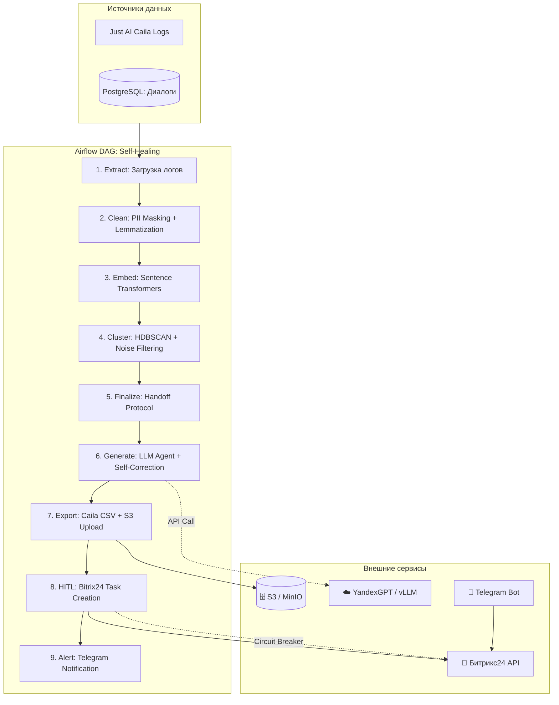

# ТЕХНИЧЕСКОЕ ЗАДАНИЕ (ТЗ)
**Наименование системы:** Автономная система "Self-Healing" для мониторинга и дообучения NLU-ботов (MLOps Pipeline)  
**Версия документа:** 1.0  
**Целевая аудитория:** Data Engineers, MLOps Engineers, Лингвисты/Аналитики ботов, ИТ-архитекторы.

---

## 1. Описание конечной системы
Система представляет собой асинхронный, событийно-ориентированный (Event-Driven) MLOps-пайплайн, работающий в фоновом режиме. Он автоматически анализирует логи диалогов, в которых NLU-бот (Just AI Caila или кастомный) не смог распознать намерение (fallback) или передал диалог на оператора. 

Система не просто агрегирует ошибки, а **самостоятельно находит новые паттерны**: очищает "шумные" данные от ошибок ASR и мусора, группирует схожие высказывания в смысловые кластеры, с помощью LLM присваивает им имена и генерирует готовые обучающие выборки. Финальный результат проходит обязательную валидацию человеком (Human-in-the-Loop) через интерфейс Битрикс24 перед импортом в боевую среду.

---

## 2. Бизнес-задача
1. **Сокращение трудозатрат лингвистов на 70%:** Исключение ручного перебора тысяч строк логов. Аналитик получает не "сырые" логи, а готовые гипотезы новых интентов с вариациями фраз.
2. **Ускорение реакции на изменения рынка:** Мгновенное выявление массовых запросов о новых акциях, сбоях или изменениях в продуктах, которые еще не заложены в сценарии бота.
3. **Повышение качества NLU:** Систематическое закрытие "слепых зон" бота, что напрямую снижает процент fallback-ответов и переводов на оператора.
4. **Гарантия безопасности данных:** Полная автоматизация процесса с жестким контролем PII, исключающим риск попадания персональных данных клиентов в промпты LLM.

---

## 3. Бизнес-метрики (KPI)
| Метрика | Описание | Целевое значение |
| :--- | :--- | :--- |
| **Time-to-Train Reduction** | Сокращение времени ручной разметки и дообучения бота. | **-70%** |
| **Cluster Quality Score** | Доля новых типовых запросов, корректно сгруппированных в осмысленные кластеры (оценка лингвиста или Silhouette Score > 0.4). | **> 85%** |
| **Pipeline Execution Time** | Время от запуска DAG до формирования готового черновика датасета. | **< 5 минут** (на суточном объеме до 100k записей) |
| **AI Suggestion Acceptance Rate** | Процент сгенерированных LLM интентов и фраз, одобренных лингвистом без существенных правок. | **> 60%** |
| **Fallback Rate Drop** | Снижение общего процента fallback-ответов бота после применения одобренных обновлений. | **-15% за квартал** |

---

## 4. Требования

### 4.1. Функциональные требования
1. **ETL и Инgestion:** Еже nightly (или по расписанию) выгрузка логов диалогов с тегами `fallback` или `transfer_to_operator` из Just AI Caila API или PostgreSQL.
2. **Жесткая предобработка (Data Cleaning):** 
   - Удаление стоп-слов, слов-паразитов, исправление типичных ошибок ASR (например, "спасиба" -> "спасибо").
   - **Критично:** Автоматическое маскирование PII (номера телефонов, ФИО, карты, email) с помощью `presidio-analyzer` *до* любого взаимодействия с LLM.
3. **Векторизация и Кластеризация:** 
   - Генерация эмбеддингов очищенных фраз.
   - Кластеризация алгоритмом HDBSCAN (способен выделять шум и не требовать заранее заданного числа кластеров).
   - Фильтрация микро-кластеров (< 5-10 фраз) как статистического шума.
4. **LLM-агент генерации:** Для каждого валидного кластера LLM должен:
   - Придумать краткое, понятное название интента (на русском языке).
   - Сгенерировать 20-30 семантически разнообразных вариаций фраз (few-shot generation) на основе примеров из кластера.
5. **HITL и Экспорт:** 
   - Формирование JSON/CSV файла в формате, готовом к импорту в Just AI Caila.
   - Создание задачи в Битрикс24 с rich-текстом (название интента, топ-5 примеров из кластера, сгенерированные фразы, ссылка на полные данные).
   - Отправка уведомления в Telegram аналитику.

### 4.2. Нефункциональные требования
1. **Идемпотентность:** Повторный запуск DAG с теми же параметрами не должен создавать дубликаты интентов или задач в Битрикс24.
2. **Масштабируемость:** Обработка до 500 000 записей за один прогон без OOM (Out of Memory) ошибок (использование батчинга при эмбеддинге).
3. **Наблюдаемость (Observability):** Сквозная трассировка (OpenTelemetry) каждого шага DAG: время извлечения, время эмбеддинга, время кластеризации, время LLM-генерации.

### 4.3. Требования безопасности и РФ-специфика
1. **Data Residency:** Все компоненты (Airflow, БД, LLM-инференс) развернуты на серверах в РФ.
2. **Zero-Trust к LLM:** Строгий запрет на передачу сырых логов в LLM. Используются только обезличенные, агрегированные представления кластеров.
3. **Аудит:** Все действия AI-агента (какой кластер во что превратился) логируются в неизменяемом виде для последующего разбора в случае генерации некорректных интентов.

---

## 5. Архитектура системы

Система построена как Directed Acyclic Graph (DAG) в Apache Airflow, с использованием паттерна **Human-in-the-Loop** для финального апрува.

---

## 6. Детальные этапы реализации

### Этап 1: Фундамент, ETL и Безопасная очистка данных (Недели 1-2)
*Цель: Создать надежный конвейер извлечения и гарантировать 100% удаление PII до любых ML-операций.*
- **Подзадача 1.1:** Настройка Apache Airflow (локально или в K8s) и подключение к Just AI Caila API / PostgreSQL для выгрузки логов с тегами `fallback`/`transfer`.
- **Подзадача 1.2:** Реализация модуля предобработки на базе `Microsoft Presidio`. Настройка кастомных паттернов для РФ (СНИЛС, ИНН, номера карт). 
- **Подзадача 1.3:** Реализация эвристической очистки "мусора": удаление фраз короче 2 слов, фильтрация явных ошибок ASR (например, последовательности бессмысленных символов), лемматизация (через `pymorphy3` или `natasha`).
- **Критерии приемки:** DAG успешно выгружает 10 000 записей, PII-сканер находит и маскирует >95% тестовых персональных данных, время этапа < 1 минуты.

### Этап 2: Векторизация и Кластеризация (Недели 3-4)
*Цель: Преодолеть "ловушку качества данных" и получить стабильные, осмысленные кластеры из зашумленных текстов.*
- **Подзадача 2.1:** Интеграция `Sentence Transformers` (модель `ai-forever/ru-en-RoSBERTa` или `multilingual-e5-large`). Реализация батчинга (batch_size=64) для предотвращения OOM.
- **Подзадача 2.2:** Настройка `HDBSCAN`. Критическая калибровка гиперпараметров: `min_cluster_size` (например, 15) и `min_samples` для отсечения шума. 
- **Подзадача 2.3:** Разработка пост-фильтрации кластеров: отбраковка кластеров с слишком низким внутренним сходством (Silhouette score < 0.2) или состоящих из однотипных "мусорных" фраз.
- **Критерии приемки:** На тестовом наборе данных система выделяет кластеры, которые при ручной проверке лингвистом признаются осмысленными в >85% случаев.

### Этап 3: LLM-агент и Генерация данных (Недели 5-6)
*Цель: Превратить сырые кластеры в структурированные обучающие данные с помощью LLM.*
- **Подзадача 3.1:** Разработка промпта для LLM-агента. Промпт должен принимать топ-10 примеров из кластера и возвращать строгий JSON: `{"intent_name": "...", "description": "...", "utterances": ["...", "..."]}`.
- **Подзадача 3.2:** Реализация валидации вывода LLM через `Pydantic V2`. Если LLM возвращает невалидный JSON или менее 10 фраз, механизм retry с уточняющим промптом (max 2 попытки).
- **Подзадача 3.3:** Интеграция с LLM-провайдером (YandexGPT Pro или локальный Llama-3 через vLLM). Настройка `temperature=0.7` для баланса между креативностью вариаций и сохранением смысла.
- **Критерии приемки:** LLM успешно генерирует валидный JSON для 95% входящих кластеров. Время генерации на один кластер < 3 секунд.

### Этап 4: HITL, Интеграции и Экспорт (Недели 7-8)
*Цель: Обеспечить удобный и безопасный процесс утверждения изменений человеком.*
- **Подзадача 4.1:** Разработка генератора файлов в формате импорта Just AI Caila (JSON/CSV с колонками `intent`, `utterance`, `weight`).
- **Подзадача 4.2:** Интеграция с Битрикс24 REST API (`task.item.add`). Создание задачи с богатым HTML-описанием: название интента, примеры из реальных логов, сгенерированные фразы, кнопки "Аппрув" / "Отклонить".
- **Подзадача 4.3:** Настройка Telegram-бота для мгновенного алертинга аналитика о появлении новой задачи на апрув.
- **Критерии приемки:** Задача в Битрикс24 создается корректно, содержит все данные и ссылки. Уведомление в Telegram приходит в течение 5 секунд после завершения DAG.

### Этап 5: Production Hardening и IaC (Неделя 9)
*Цель: Обеспечить надежность, масштабируемость и наблюдаемость системы.*
- **Подзадача 5.1:** Упаковка компонентов (Airflow workers, LLM-прокси) в Docker-контейнеры. Описание инфраструктуры через Terraform (K8s cluster, Managed PostgreSQL).
- **Подзадача 5.2:** Внедрение OpenTelemetry в Airflow DAGs. Настройка дашборда в Grafana для мониторинга: "Количество новых кластеров в день", "Время выполнения DAG", "Ошибки LLM API".
- **Подзадача 5.3:** Настройка алертов (Alertmanager): "DAG failed", "Количество PII-утечек в промптах > 0", "HDBSCAN вернул 0 валидных кластеров" (возможная деградация качества логов).
- **Критерии приемки:** Система развернута через CI/CD. Нагрузочный тест на 100 000 записей проходит успешно, алерты срабатывают при искусственном сбое.

---

## 7. Стек технологий и варианты

| Компонент | Основной вариант (Рекомендуемый) | Альтернативный вариант | Обоснование выбора |
| :--- | :--- | :--- | :--- |
| **Оркестрация** | **Apache Airflow** | Prefect / Dagster | Airflow является индустриальным стандартом для ETL/ML пайплайнов, имеет огромную экосистему готовых операторов (Caila, Bitrix, Postgres). |
| **Кластеризация** | **HDBSCAN** (`scikit-learn` / `hdbscan`) | **BERTopic** | HDBSCAN идеально подходит, так как не требует задания числа кластеров и умеет выделять "шум" (outliers). BERTopic — отличная надстройка над ним, если потребуется c-TF-IDF для авто-названий. |
| **Эмбеддинги** | `ai-forever/ru-en-RoSBERTa` | `intfloat/multilingual-e5-large` | RoSBERTa специально дообучена на больших корпусах русского языка и показывает лучшие результаты на коротких, зашумленных текстах (чатах). |
| **PII Masking** | **Microsoft Presidio** | Кастомные RegEx | Presidio использует NER-модели (spaCy), что дает высокую точность распознавания контекстных данных, в отличие от хрупких регулярных выражений. |
| **LLM для генерации**| **YandexGPT Pro** (Cloud) | **Llama 3 8B** (Local, vLLM) | YandexGPT гарантирует 152-ФЗ и прост в интеграции. Локальная Llama 3 выбирается, если политика безопасности запрещает передачу даже обезличенных агрегатов во внешнее облако. |
| **Интеграции** | `httpx` (Async), Just AI Caila API | - | Асинхронный клиент критичен для скорости работы DAG при массовых вызовах API. |

---

## 8. Ключевые риски и стратегии их mitigation (из предварительного анализа)

1. **Риск "Garbage In, Garbage Out" (Шум в ASR):** 
   - *Mitigation:* Агрессивная предобработка на Этапе 1. Если фраза содержит >40% нераспознанных символов или состоит только из стоп-слов, она маркируется как `noise` и исключается из кластеризации, чтобы не создавать "мусорные" интенты.
2. **Риск утечки PII через LLM:** 
   - *Mitigation:* Архитектурный шлюз. Модуль `presidio` является *обязательным* и *неотключаемым* шагом в DAG перед любым вызовом LLM. Логи промптов сохраняются в "замаскированном" виде для аудита.
3. **Риск "Взрыва" количества микро-кластеров:**
   - *Mitigation:* Жесткая настройка `min_cluster_size` в HDBSCAN и пост-фильтрация по метрике плотности кластера. Аналитику отправляются только топ-20 самых крупных и плотных новых кластеров за период, а не сотни мелких.
